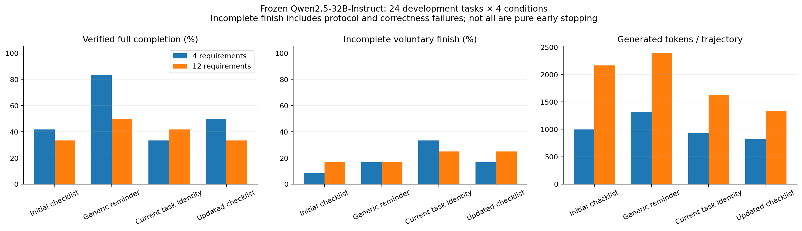

# File/data/code agent smoke-test results

Completed 96/96 main trajectories. This is a development smoke test, not a confirmatory experiment.

| Condition | Completion rate | Voluntary termination while incomplete | Mean output tokens | Mean tool/termination rounds |
|---|---:|---:|---:|---:|
| plan | 37.5% | 12.5% | 1582 | 3.5 |
| reminder | 66.7% | 16.7% | 1855 | 4.8 |
| identity | 37.5% | 29.2% | 1278 | 3.8 |
| todo | 41.7% | 20.8% | 1079 | 3.1 |

See analysis/results.json for all task families, lengths, paired differences, and raw paths, and analysis/cases.jsonl for per-example judgments. All raw trajectories have been independently verified and replayed. See the [full conclusions](CONCLUSIONS.md) for interpretation. This batch showed no advantage from identity restatement. Subsequent compatibility repairs failed the capability threshold, so neither a second main comparison nor training was conducted.

