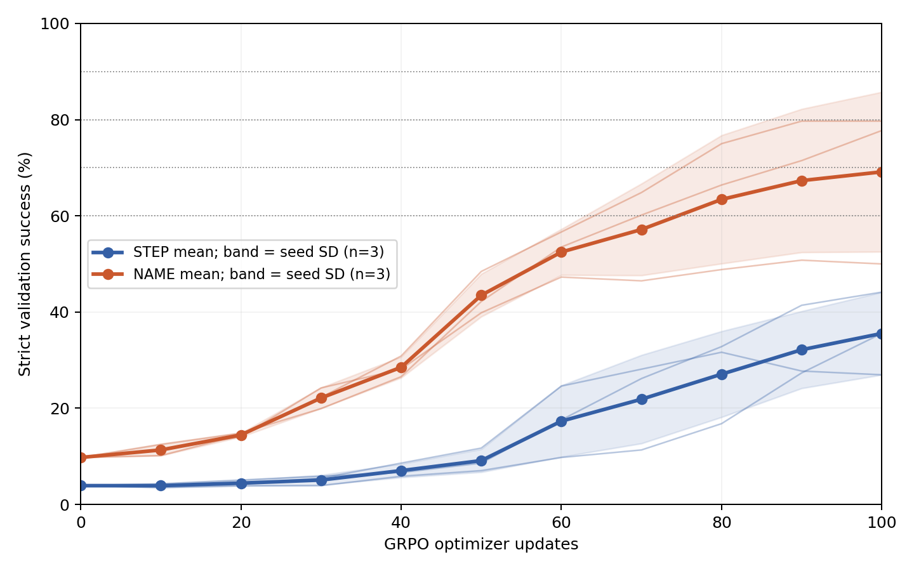
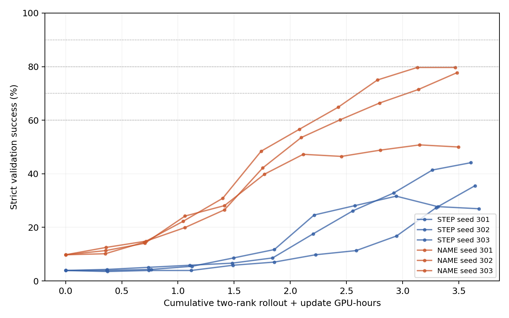

# B01-02：二值奖励GRPO标签学习对照

Qwen2.5-14B-Instruct原始revision、固定L5；九工具及STEP/NAME Prompt与前轮一致；BF16基座+LoRA，无额外SFT。奖励仅严格完整轨迹0/1，标题不计奖励。6run各100更新，每更新16题×8候选。

## 新测试集端点（512题）

| seed | STEP step0→100 | STEP提升 | NAME step0→100 | NAME提升 | NAME−STEP端点差 |
|---:|---:|---:|---:|---:|---:|
| 301 | 5.47%→24.41% | +18.95 pp | 10.55%→53.71% | +43.16 pp | +29.30 pp |
| 302 | 5.47%→32.23% | +26.76 pp | 10.55%→78.32% | +67.77 pp | +46.09 pp |
| 303 | 5.47%→42.19% | +36.72 pp | 10.55%→80.27% | +69.73 pp | +38.09 pp |

STEP：step100为32.94% ± 8.91%（3seed均值±样本SD）；相对本组step0平均提升+27.47个百分点。

NAME：step100为70.77% ± 14.80%（3seed均值±样本SD）；相对本组step0平均提升+60.22个百分点。

配对NAME−STEP端点差均值+37.83 ± 8.40个百分点；3/3 seed为正。两组提升幅度之差均值+32.75个百分点。三个seed仅初步重复，不把seed×题数合并成大量独立模型重复。

step0为同一原始策略，每条件各算一次新验证/测试并由三个seed明确引用；各run单独保留其配对LoRA初始化checkpoint。新测试集只在预定step0和100评分，没有挑最好checkpoint。

## 验证门槛与完整学习曲线

| 条件 | seed | 首次60% | 首次70% | 首次80% | 首次90% | 曲线平均成功率（梯形面积/100） |
|---|---:|---:|---:|---:|---:|---:|
| STEP | 301 | 未达到 | 未达到 | 未达到 | 未达到 | 16.15% |
| NAME | 301 | 未达到 | 未达到 | 未达到 | 未达到 | 34.08% |
| STEP | 302 | 未达到 | 未达到 | 未达到 | 未达到 | 10.92% |
| NAME | 302 | 70 | 90 | 未达到 | 未达到 | 41.13% |
| STEP | 303 | 未达到 | 未达到 | 未达到 | 未达到 | 17.25% |
| NAME | 303 | 70 | 80 | 未达到 | 未达到 | 44.71% |

门槛按step0/10/…/100固定评测点首次达到；不推断两检查点之间的精确跨越时刻，也不将未达到按任意更新数补值。完整逐seed曲线及每点实际训练token/GPU时间在analysis/results.json。

## 采样、优化与成本

| 条件 | seed | 候选数 | 输出token | 组内奖励有区分度比例 | 候选重复比例 | 最大KL | 训练段GPU小时 |
|---|---:|---:|---:|---:|---:|---:|---:|
| STEP | 301 | 12800 | 1962589 | 19.50% | 43.24% | 0.27417 | 3.832 |
| NAME | 301 | 12800 | 1902796 | 30.06% | 55.88% | 0.38294 | 3.645 |
| STEP | 302 | 12800 | 1967216 | 15.50% | 40.62% | 0.08399 | 3.796 |
| NAME | 302 | 12800 | 1902983 | 27.31% | 59.50% | 0.14438 | 3.631 |
| STEP | 303 | 12800 | 1943132 | 21.69% | 43.40% | 0.13106 | 3.754 |
| NAME | 303 | 12800 | 1906171 | 30.38% | 59.30% | 10.13671 | 3.623 |

候选重复比例在同一道题的8个输出内部统计。全0/全1组保留，任务优势为0，仍可能存在KL梯度。相同更新预算不等于相同计算量；compute曲线累计两rank采样和更新墙钟，训练段GPU时间按NCCL初始化完成后的run墙钟×2计算，含模型加载、保存及等待，不含此前的进程/NCCL启动，也不是GPU内核活动时间。完整作业占用时间、评测及预检/恢复开销在全组成本审计中单列；这些嵌套计时不可相加。

## 标题、错误及结束原因（step100新测试）

| 条件 | seed | 标题全合规 | 操作序列不符 | 数字错误 | 前缀提前停止 | 额外原始操作 | 格式额外行 | 截断 |
|---|---:|---:|---:|---:|---:|---:|---:|---:|
| STEP | 301 | 96.48% | 266 | 228 | 17 | 194 | 17 | 1 |
| NAME | 301 | 93.16% | 52 | 208 | 16 | 19 | 0 | 0 |
| STEP | 302 | 97.66% | 211 | 224 | 26 | 126 | 4 | 0 |
| NAME | 302 | 94.92% | 45 | 71 | 15 | 16 | 0 | 0 |
| STEP | 303 | 96.88% | 114 | 236 | 21 | 43 | 2 | 0 |
| NAME | 303 | 97.07% | 54 | 57 | 10 | 36 | 0 | 0 |

错误标志非互斥；数字错误按输出前一步状态核验，展开不符包括额外/缺失操作。额外原始操作不直接称作额外工具调用；合法标题的合规另列，不纳入二值奖励。逐题原始输出、token IDs、EOS/上限证据保留在eval/outputs/。

## 证据与解释边界

冻结配置config/frozen.json及freeze-manifest.json；数据data/manifest.json；预检analysis/precheck-complete.json；固定checkpoint与候选runs/v1-*；完整曲线/配对/成本analysis/results.json；实现口径见上级REGISTRATION.md。全组合判断与验收见上级REPORT.md及COMPLETION_AUDIT.md。

本轮只比较给定计划下的标签结构是否帮助训练执行。未加入内部/局部奖励，未验证真实数学或Agent迁移、跨模型泛化或创新性，不将方法收益与内部机制假设混为一谈。

补充的互斥错误归类、标题边界与原始/标准轨迹案例见[CASE_REVIEW.md](CASE_REVIEW.md)。该归类只解释输出，不改变评分；标题不合规不等于工具身份错误。
