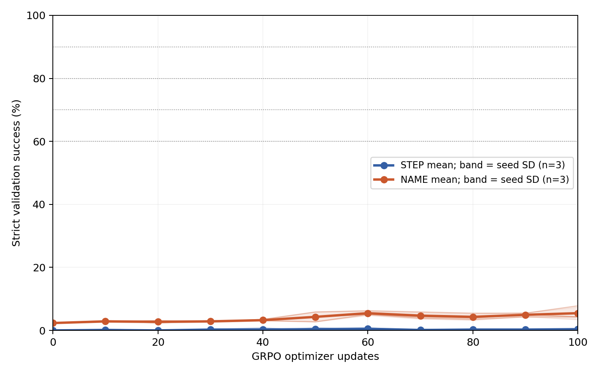
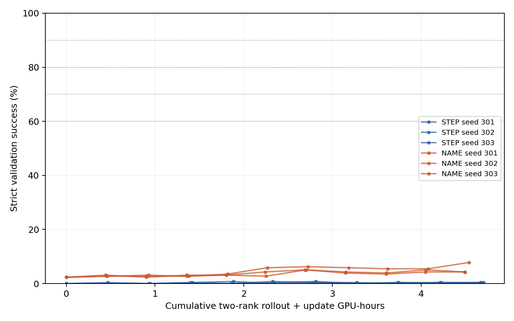

# B01-02: label comparison under binary-reward GRPO

Qwen2.5-14B-Instruct at the original revision, fixed L7; the nine tools and STEP/NAME prompts match the previous study; BF16 base + LoRA, with no additional SFT. Reward is strict full-trajectory 0/1, with no heading reward. Each of 6 runs has 100 updates, using 16 examples x 8 candidates per update.

## Fresh test endpoints (512 examples)

| seed | STEP step0 to 100 | STEP gain | NAME step0 to 100 | NAME gain | NAME-STEP endpoint difference |
|---:|---:|---:|---:|---:|---:|
| 301 | 0.78%→0.98% | +0.20 pp | 3.52%→8.59% | +5.08 pp | +7.62 pp |
| 302 | 0.78%→0.59% | -0.20 pp | 3.52%→6.25% | +2.73 pp | +5.66 pp |
| 303 | 0.78%→0.59% | -0.20 pp | 3.52%→7.03% | +3.52 pp | +6.45 pp |

STEP: step100 = 0.72% ± 0.23% (3-seed mean +/- sample SD); mean gain over the condition-specific step0 = -0.07 percentage points.

NAME: step100 = 7.29% ± 1.19% (3-seed mean +/- sample SD); mean gain over the condition-specific step0 = +3.78 percentage points.

Mean paired NAME-STEP endpoint difference: +6.58 ± 0.98 percentage points; 3/3 seeds are positive. Mean difference in learning gains: +3.84 percentage points. Three seeds provide preliminary replication; seed x example counts are not treated as many independent model replications.

step0 uses the same original policy: fresh validation/test outputs are generated once per condition and explicitly referenced by three seeds. Each run retains its own paired LoRA initialization checkpoint. The fresh test set is scored only at the scheduled step0 and 100, with no best-checkpoint selection.

## Validation thresholds and complete learning curves

| Condition | seed | First 60% | First 70% | First 80% | First 90% | Mean curve success (trapezoidal area/100) |
|---|---:|---:|---:|---:|---:|---:|
| STEP | 301 | Not reached | Not reached | Not reached | Not reached | 0.29% |
| NAME | 301 | Not reached | Not reached | Not reached | Not reached | 4.61% |
| STEP | 302 | Not reached | Not reached | Not reached | Not reached | 0.21% |
| NAME | 302 | Not reached | Not reached | Not reached | Not reached | 3.57% |
| STEP | 303 | Not reached | Not reached | Not reached | Not reached | 0.21% |
| NAME | 303 | Not reached | Not reached | Not reached | Not reached | 3.61% |

Thresholds record the first fixed evaluation point at step0/10/.../100 that reaches the target. Exact crossing times between checkpoints are not inferred, and unreached thresholds receive no arbitrary update count. Complete per-seed curves and actual training tokens/GPU time at every point are in analysis/results.json.

## Sampling, optimization, and costs

| Condition | seed | Candidates | Output tokens | Mixed-reward group fraction | Duplicate candidate fraction | Maximum KL | Training-segment GPU-hours |
|---|---:|---:|---:|---:|---:|---:|---:|
| STEP | 301 | 12800 | 2553603 | 1.75% | 15.64% | 0.01665 | 4.826 |
| NAME | 301 | 12800 | 2571883 | 8.88% | 29.23% | 0.01471 | 4.689 |
| STEP | 302 | 12800 | 2548274 | 1.62% | 14.87% | 1.53695 | 4.852 |
| NAME | 302 | 12800 | 2560753 | 8.38% | 27.82% | 9.52698 | 4.640 |
| STEP | 303 | 12800 | 2545889 | 1.19% | 15.35% | 0.79324 | 4.909 |
| NAME | 303 | 12800 | 2561718 | 9.31% | 27.94% | 0.05190 | 4.647 |

Duplicate fractions are measured within the 8 outputs for each example. All-0/all-1 groups are retained with zero task advantage, though KL gradients may remain. Equal update budgets do not imply equal compute. Compute curves accumulate sampling and update wall time across both ranks. Training-segment GPU time is run wall time after NCCL initialization x2, including model loading, saving, and waiting, but excluding earlier process/NCCL startup; it is not active GPU-kernel time. Full job occupancy, evaluation, and precheck/recovery costs are listed separately in the combined cost audit. These nested timings must not be added together.

## Headings, errors, and stopping reasons (step100 fresh test)

| Condition | seed | Fully compliant headings | Operation-sequence mismatch | Numerical error | Early prefix stop | Extra raw operations | Extra format lines | Truncation |
|---|---:|---:|---:|---:|---:|---:|---:|---:|
| STEP | 301 | 47.66% | 450 | 448 | 81 | 170 | 8 | 0 |
| NAME | 301 | 68.55% | 191 | 433 | 66 | 60 | 1 | 0 |
| STEP | 302 | 46.29% | 459 | 454 | 78 | 170 | 6 | 0 |
| NAME | 302 | 67.97% | 233 | 438 | 60 | 98 | 5 | 0 |
| STEP | 303 | 46.09% | 451 | 457 | 80 | 163 | 4 | 0 |
| NAME | 303 | 67.58% | 233 | 436 | 68 | 102 | 5 | 0 |

Error flags can overlap. Numerical errors are checked against the preceding output state; expansion mismatches include extra/missing operations. Extra raw operations are not directly counted as extra tool calls. Heading compliance is reported separately and excluded from binary rewards. Per-example raw outputs, token IDs, and EOS/cap evidence are retained in eval/outputs/.

## Evidence and scope of interpretation

Frozen configurations: config/frozen.json and freeze-manifest.json; data: data/manifest.json; prechecks: analysis/precheck-complete.json; fixed checkpoints and candidates: runs/v1-*; complete curves/pairing/costs: analysis/results.json. Implementation definitions are in the parent REGISTRATION.md. See the parent REPORT.md and COMPLETION_AUDIT.md for combined interpretation and acceptance checks.

This study compares whether label structure helps train execution under a supplied plan. It adds no internal/local rewards and does not establish transfer to real mathematics or agents, cross-model generalization, or novelty. Method gains are distinguished from hypotheses about internal mechanisms.

See [CASE_REVIEW.md](CASE_REVIEW.md) for supplementary mutually exclusive error categories, heading boundaries, and raw/reference trajectory examples. These categories interpret outputs without changing scores; heading noncompliance is distinct from tool-identity error.
