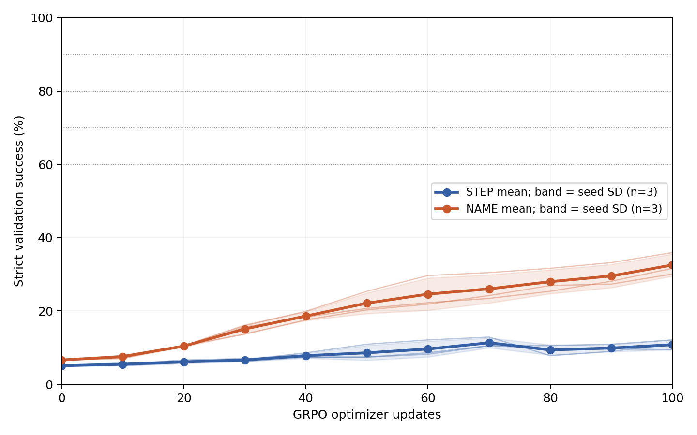
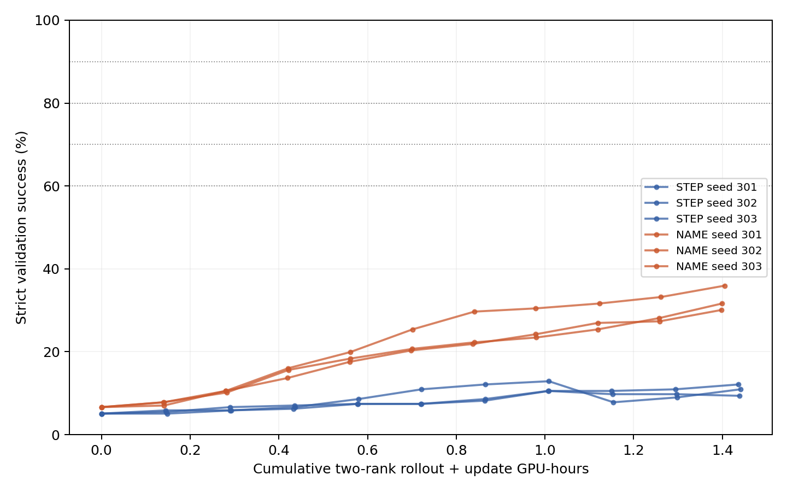

# B01-02：二值奖励GRPO标签学习对照

Qwen2.5-7B-Instruct原始revision、固定L3；九工具及STEP/NAME Prompt与前轮一致；BF16基座+LoRA，无额外SFT。奖励仅严格完整轨迹0/1，标题不计奖励。6run各100更新，每更新16题×8候选。

## 新测试集端点（512题）

| seed | STEP step0→100 | STEP提升 | NAME step0→100 | NAME提升 | NAME−STEP端点差 |
|---:|---:|---:|---:|---:|---:|
| 301 | 3.91%→8.79% | +4.88 pp | 7.23%→28.91% | +21.68 pp | +20.12 pp |
| 302 | 3.91%→8.40% | +4.49 pp | 7.23%→33.01% | +25.78 pp | +24.61 pp |
| 303 | 3.91%→7.62% | +3.71 pp | 7.23%→36.33% | +29.10 pp | +28.71 pp |

STEP：step100为8.27% ± 0.60%（3seed均值±样本SD）；相对本组step0平均提升+4.36个百分点。

NAME：step100为32.75% ± 3.72%（3seed均值±样本SD）；相对本组step0平均提升+25.52个百分点。

配对NAME−STEP端点差均值+24.48 ± 4.30个百分点；3/3 seed为正。两组提升幅度之差均值+21.16个百分点。三个seed仅初步重复，不把seed×题数合并成大量独立模型重复。

step0为同一原始策略，每条件各算一次新验证/测试并由三个seed明确引用；各run单独保留其配对LoRA初始化checkpoint。新测试集只在预定step0和100评分，没有挑最好checkpoint。

## 验证门槛与完整学习曲线

| 条件 | seed | 首次60% | 首次70% | 首次80% | 首次90% | 曲线平均成功率（梯形面积/100） |
|---|---:|---:|---:|---:|---:|---:|
| STEP | 301 | 未达到 | 未达到 | 未达到 | 未达到 | 8.69% |
| NAME | 301 | 未达到 | 未达到 | 未达到 | 未达到 | 18.79% |
| STEP | 302 | 未达到 | 未达到 | 未达到 | 未达到 | 8.20% |
| NAME | 302 | 未达到 | 未达到 | 未达到 | 未达到 | 19.10% |
| STEP | 303 | 未达到 | 未达到 | 未达到 | 未达到 | 7.95% |
| NAME | 303 | 未达到 | 未达到 | 未达到 | 未达到 | 22.60% |

门槛按step0/10/…/100固定评测点首次达到；不推断两检查点之间的精确跨越时刻，也不将未达到按任意更新数补值。完整逐seed曲线及每点实际训练token/GPU时间在analysis/results.json。

## 采样、优化与成本

| 条件 | seed | 候选数 | 输出token | 组内奖励有区分度比例 | 候选重复比例 | 最大KL | 训练段GPU小时 |
|---|---:|---:|---:|---:|---:|---:|---:|
| STEP | 301 | 12800 | 1209688 | 11.50% | 25.48% | 0.03079 | 1.581 |
| NAME | 301 | 12800 | 1178337 | 18.56% | 35.68% | 0.08166 | 1.542 |
| STEP | 302 | 12800 | 1204276 | 10.88% | 24.41% | 0.03208 | 1.578 |
| NAME | 302 | 12800 | 1169590 | 19.94% | 37.41% | 0.10883 | 1.542 |
| STEP | 303 | 12800 | 1210651 | 9.81% | 24.17% | 0.08079 | 1.582 |
| NAME | 303 | 12800 | 1174228 | 23.94% | 38.02% | 0.50676 | 1.548 |

候选重复比例在同一道题的8个输出内部统计。全0/全1组保留，任务优势为0，仍可能存在KL梯度。相同更新预算不等于相同计算量；compute曲线累计两rank采样和更新墙钟，训练段GPU时间按NCCL初始化完成后的run墙钟×2计算，含模型加载、保存及等待，不含此前的进程/NCCL启动，也不是GPU内核活动时间。完整作业占用时间、评测及预检/恢复开销在全组成本审计中单列；这些嵌套计时不可相加。

## 标题、错误及结束原因（step100新测试）

| 条件 | seed | 标题全合规 | 操作序列不符 | 数字错误 | 前缀提前停止 | 额外原始操作 | 格式额外行 | 截断 |
|---|---:|---:|---:|---:|---:|---:|---:|---:|
| STEP | 301 | 93.95% | 321 | 385 | 25 | 172 | 9 | 0 |
| NAME | 301 | 94.53% | 123 | 320 | 20 | 60 | 8 | 0 |
| STEP | 302 | 93.36% | 327 | 382 | 25 | 185 | 5 | 0 |
| NAME | 302 | 95.31% | 113 | 304 | 18 | 60 | 4 | 0 |
| STEP | 303 | 90.43% | 326 | 405 | 37 | 170 | 9 | 0 |
| NAME | 303 | 95.31% | 104 | 277 | 24 | 35 | 3 | 0 |

错误标志非互斥；数字错误按输出前一步状态核验，展开不符包括额外/缺失操作。额外原始操作不直接称作额外工具调用；合法标题的合规另列，不纳入二值奖励。逐题原始输出、token IDs、EOS/上限证据保留在eval/outputs/。

## 证据与解释边界

冻结配置config/frozen.json及freeze-manifest.json；数据data/manifest.json；预检analysis/precheck-complete.json；固定checkpoint与候选runs/v1-*；完整曲线/配对/成本analysis/results.json；实现口径见上级REGISTRATION.md。全组合判断与验收见上级REPORT.md及COMPLETION_AUDIT.md。

本轮只比较给定计划下的标签结构是否帮助训练执行。未加入内部/局部奖励，未验证真实数学或Agent迁移、跨模型泛化或创新性，不将方法收益与内部机制假设混为一谈。

补充的互斥错误归类、标题边界与原始/标准轨迹案例见[CASE_REVIEW.md](CASE_REVIEW.md)。该归类只解释输出，不改变评分；标题不合规不等于工具身份错误。
