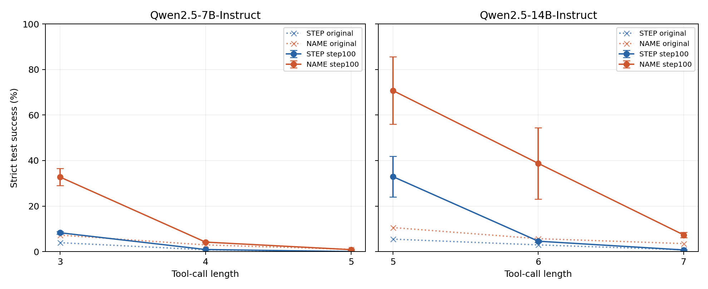
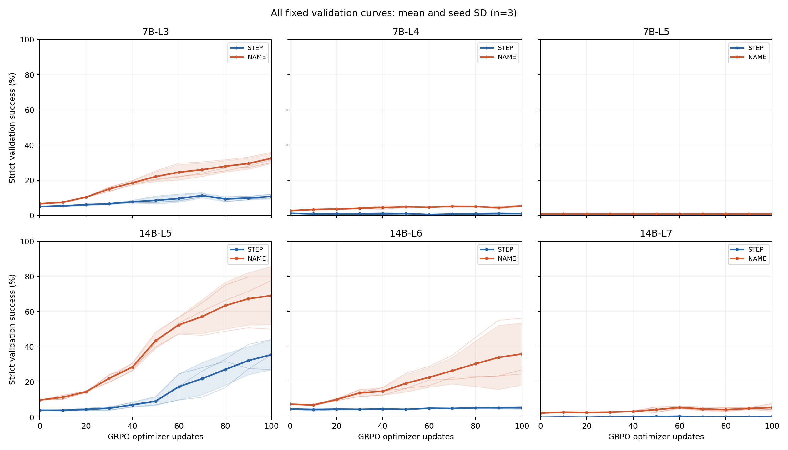

# 二值GRPO：模型×长度扩展完整结果

所有6组合均完成STEP/NAME×3配对seed，每run100更新。主指标严格完整轨迹成功率。下列均为新测试集512题的预定端点；误差为seed样本SD，不是题目抽样置信区间。

| 组合 | STEP step0→100均值±SD | NAME step0→100均值±SD | 配对NAME−STEP均值±SD(pp) | 正/负/平seed | STEP验证终点 | 20%–90%候选窗口 |
|---|---:|---:|---:|---|---:|---|
| 7b-L3 | 3.91%→8.27% ±0.60pp | 7.23%→32.75% ±3.72pp | +24.48 ±4.30 | 3/0/0 | 10.81% | 否 |
| 7b-L4 | 0.78%→0.91% ±0.11pp | 2.93%→4.17% ±0.30pp | +3.26 ±0.23 | 3/0/0 | 1.04% | 否 |
| 7b-L5 | 0.00%→0.00% ±0.00pp | 0.98%→0.85% ±0.30pp | +0.85 ±0.30 | 3/0/0 | 0.00% | 否 |
| 14b-L5 | 5.47%→32.94% ±8.91pp | 10.55%→70.77% ±14.80pp | +37.83 ±8.40 | 3/0/0 | 35.55% | 是 |
| 14b-L6 | 2.93%→4.56% ±0.49pp | 5.66%→38.74% ±15.69pp | +34.18 ±15.23 | 3/0/0 | 5.34% | 否 |
| 14b-L7 | 0.78%→0.72% ±0.23pp | 3.52%→7.29% ±1.19pp | +6.58 ±0.98 | 3/0/0 | 0.39% | 否 |

候选窗口按运行前登记的STEP固定验证集step100三seed均值20%–90%判断，不按NAME差值大小挑组，不据测试挑checkpoint。全部连续值及seed波动保留，候选仍须独立确认。每个组合的原始step0按条件评测一次供3seed共享，不算3次独立模型证据。

## 全部预定门槛

| 组合 | 条件 | seed | 60% | 70% | 80% | 90% |
|---|---|---:|---:|---:|---:|---:|
| 7b-L3 | STEP | 301 | 未达到 | 未达到 | 未达到 | 未达到 |
| 7b-L3 | NAME | 301 | 未达到 | 未达到 | 未达到 | 未达到 |
| 7b-L3 | STEP | 302 | 未达到 | 未达到 | 未达到 | 未达到 |
| 7b-L3 | NAME | 302 | 未达到 | 未达到 | 未达到 | 未达到 |
| 7b-L3 | STEP | 303 | 未达到 | 未达到 | 未达到 | 未达到 |
| 7b-L3 | NAME | 303 | 未达到 | 未达到 | 未达到 | 未达到 |
| 7b-L4 | STEP | 301 | 未达到 | 未达到 | 未达到 | 未达到 |
| 7b-L4 | NAME | 301 | 未达到 | 未达到 | 未达到 | 未达到 |
| 7b-L4 | STEP | 302 | 未达到 | 未达到 | 未达到 | 未达到 |
| 7b-L4 | NAME | 302 | 未达到 | 未达到 | 未达到 | 未达到 |
| 7b-L4 | STEP | 303 | 未达到 | 未达到 | 未达到 | 未达到 |
| 7b-L4 | NAME | 303 | 未达到 | 未达到 | 未达到 | 未达到 |
| 7b-L5 | STEP | 301 | 未达到 | 未达到 | 未达到 | 未达到 |
| 7b-L5 | NAME | 301 | 未达到 | 未达到 | 未达到 | 未达到 |
| 7b-L5 | STEP | 302 | 未达到 | 未达到 | 未达到 | 未达到 |
| 7b-L5 | NAME | 302 | 未达到 | 未达到 | 未达到 | 未达到 |
| 7b-L5 | STEP | 303 | 未达到 | 未达到 | 未达到 | 未达到 |
| 7b-L5 | NAME | 303 | 未达到 | 未达到 | 未达到 | 未达到 |
| 14b-L5 | STEP | 301 | 未达到 | 未达到 | 未达到 | 未达到 |
| 14b-L5 | NAME | 301 | 未达到 | 未达到 | 未达到 | 未达到 |
| 14b-L5 | STEP | 302 | 未达到 | 未达到 | 未达到 | 未达到 |
| 14b-L5 | NAME | 302 | 70 | 90 | 未达到 | 未达到 |
| 14b-L5 | STEP | 303 | 未达到 | 未达到 | 未达到 | 未达到 |
| 14b-L5 | NAME | 303 | 70 | 80 | 未达到 | 未达到 |
| 14b-L6 | STEP | 301 | 未达到 | 未达到 | 未达到 | 未达到 |
| 14b-L6 | NAME | 301 | 未达到 | 未达到 | 未达到 | 未达到 |
| 14b-L6 | STEP | 302 | 未达到 | 未达到 | 未达到 | 未达到 |
| 14b-L6 | NAME | 302 | 未达到 | 未达到 | 未达到 | 未达到 |
| 14b-L6 | STEP | 303 | 未达到 | 未达到 | 未达到 | 未达到 |
| 14b-L6 | NAME | 303 | 未达到 | 未达到 | 未达到 | 未达到 |
| 14b-L7 | STEP | 301 | 未达到 | 未达到 | 未达到 | 未达到 |
| 14b-L7 | NAME | 301 | 未达到 | 未达到 | 未达到 | 未达到 |
| 14b-L7 | STEP | 302 | 未达到 | 未达到 | 未达到 | 未达到 |
| 14b-L7 | NAME | 302 | 未达到 | 未达到 | 未达到 | 未达到 |
| 14b-L7 | STEP | 303 | 未达到 | 未达到 | 未达到 | 未达到 |
| 14b-L7 | NAME | 303 | 未达到 | 未达到 | 未达到 | 未达到 |

阈值仅在step0/10/.../100固定评测点判断；所有门槛与全部曲线共同解释，未达到不补任意更新数。训练GPU时间和输出token轴的曲线见各组合报告，不把等更新视为等计算。

## 每组证据

- [7b-L3完整报告](7b-L3/REPORT.md)：逐seed端点、基准提升、配对差、曲线、采样/成本/错误及标题。
- [7b-L4完整报告](7b-L4/REPORT.md)：逐seed端点、基准提升、配对差、曲线、采样/成本/错误及标题。
- [7b-L5完整报告](7b-L5/REPORT.md)：逐seed端点、基准提升、配对差、曲线、采样/成本/错误及标题。
- [14b-L5完整报告](14b-L5/REPORT.md)：逐seed端点、基准提升、配对差、曲线、采样/成本/错误及标题。
- [14b-L6完整报告](14b-L6/REPORT.md)：逐seed端点、基准提升、配对差、曲线、采样/成本/错误及标题。
- [14b-L7完整报告](14b-L7/REPORT.md)：逐seed端点、基准提升、配对差、曲线、采样/成本/错误及标题。

整体判断、故障和资源验收见CONCLUSIONS.md与COMPLETION_AUDIT.md。固定L5两模型共享底层数据；整个六组合是探索性组合筛查，不是六次独立正式确认。
