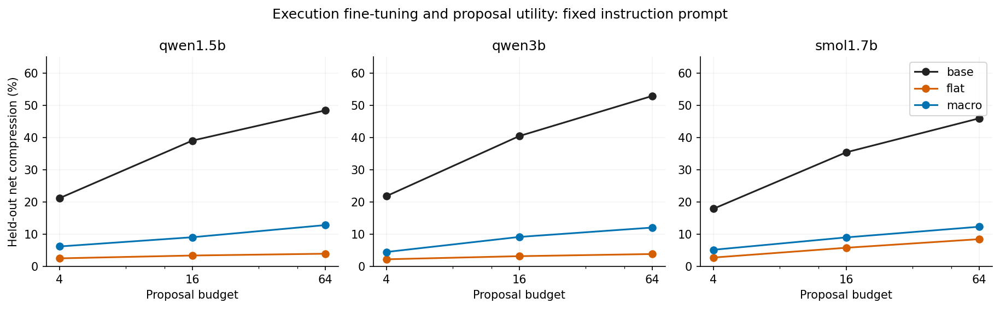
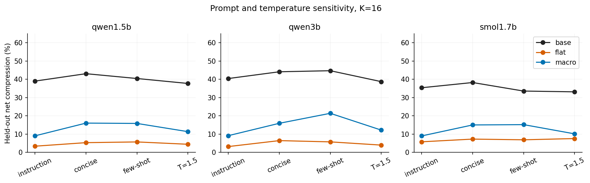
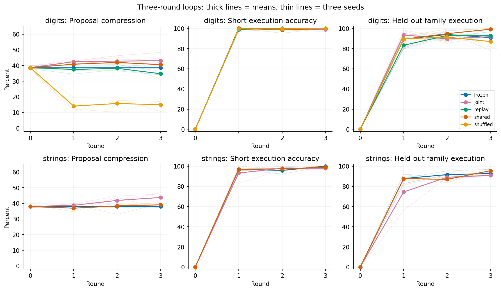
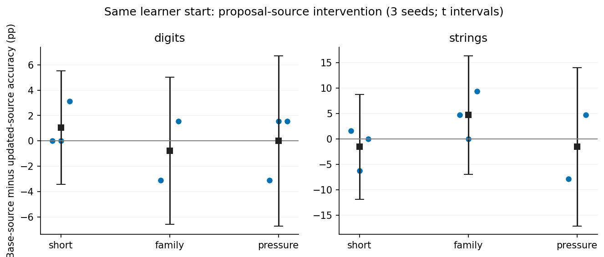
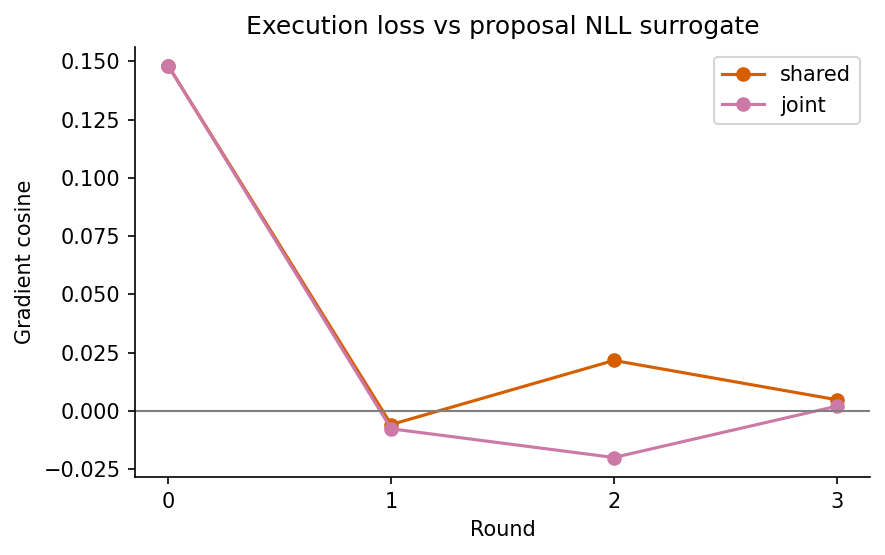

# Execution learning and improvement capability: extended results

Generated at (UTC): 2026-09-24T05:12:55Z. This user-authorized RSI extension has completed actual model/data experiments and awaits consolidated review.

## Research question and interpretation

Distinguish execution E under a given prompt, abstraction utility P under finite proposal budgets, and learning gain G after proposals shape next-round training data. E↑ with P↓ does not imply G↓ or impossibility of open-ended RSI. See [MECHANISM.md](MECHANISM.md) for counterexamples and limits.

Original-recipe proposal degradation replicates across three models and persists under prompt, budget, length, and coverage controls. The new three-round loop preserves utility. Same-start branches have not established reliable subsequent-learning harm. Evidence supports conditional execution/proposal separation, not a proven universal RSI bottleneck.

See [CONCLUSIONS.md](CONCLUSIONS.md). This report retains the full design/main tables without selecting favorable models, prompts, rounds, or domains.

## Actual scale

- Three models across two families: Qwen2.5-1.5B, Qwen2.5-3B, SmolLM2-1.7B. The latter two were downloaded for this round with frozen revisions/hashes.
- Initial-setting replication adds twelve 512-step LoRA runs and two frozen execution baselines; six original 1.5B adapters are reused.
- Robustness: 27 jobs, base/flat/macro with three seeds per model, three prompts plus a temperature check, 16 fresh test families with 64 proposals each. K=4/16/64 share sampled prefixes.
- Closed loop: 24 three-round trajectories, five numeric conditions × three seeds and three string conditions × three seeds. Each round has 128 steps, batch 16; rounds 0–3 are retained.
- Twelve prespecified same-start branches plus six post hoc degraded-proposer stress branches, each with 128 steps. Six loop and three original-recipe gradient diagnostics do not update parameters. Original macro training repeats across three seeds at checkpoints 0/16/64/128/256/512. Three length-matched primitive-coverage runs and 27 length-quota controls are explicitly post hoc.
- Total: 180,864 actual proposals and 50,464 execution records. Repeated measurements of one example/model are not equally many independent samples.
- Audited 150 adapter hashes; approximately 4.67 allocated GPU-hours, excluding downloads/prior waiting and distinct from kernel-active time.

## Multi-model execution and proposal controls

Execution uses the original macro-call task; proposals use 16 new test families. Primary proposal settings are instruction, T=1, K=16. Values average three seeds; base seeds vary sampling, not base-model training.

| Model | Training format | IID execution | Unseen-composition execution | Net proposal compression: base → trained |
|---|---|---:|---:|---:|
| qwen1.5b | flat | 100.00% | 0.09% | 39.01% → 3.39% |
| qwen1.5b | macro | 100.00% | 29.77% | 39.01% → 9.06% |
| qwen3b | flat | 100.00% | 0.09% | 40.42% → 3.19% |
| qwen3b | macro | 100.00% | 60.76% | 40.42% → 9.15% |
| smol1.7b | flat | 100.00% | 0.00% | 35.39% → 5.80% |
| smol1.7b | macro | 100.00% | 22.66% | 35.39% → 9.01% |

Full seed/family differences and family bootstrap results: [robust-results.json](analysis/robust-results.json). Frozen execution baselines have format limitations; increased trained IID accuracy alone does not establish newly acquired internal algorithms. Tokenizers differ, so equal steps/examples need not yield equal supervised tokens; see actual counts in the [audit](analysis/verification.json).

## Three-round closed loop

Stages A/B differ in input representation, task distribution, learning rate, and update amount; see [RECIPE_COMPARISON.md](RECIPE_COMPARISON.md). Absence of degradation in B limits the phenomenon's scope but identifies no single protective factor.

Each round, models propose 16 candidates from support programs in 12 training families. Support-set greedy selection chooses at most three macros, shaping next-round execution-training operation distributions. The environment supplies execution truth; test families never enter training. Training and fixed evaluation programs are exactly semantically disjoint.

shared: one updated model continues proposing and executing. frozen: the initial base proposes while the executor updates. replay: shared plus initial-proposal replay. joint: shared plus supervision on proposals selected from current support. shuffled: replay targets are reassigned to prompts within equal-token-length buckets. Auxiliary loss weight is 0.2 with four extra examples per step; every condition has 16 execution examples. Auxiliary methods add compute, so total compute is unequal.

| Domain | Condition | Net proposal compression: round 0→3 | Short-program execution: round 0→3 | Unseen-family execution: round 0→3 | Round-3 exact primitive sequence |
|---|---|---:|---:|---:|---:|
| digits | frozen | 38.69% → 38.69% | 0.00% → 100.00% | 0.00% → 90.89% | 91.15% |
| digits | joint | 38.69% → 43.15% | 0.00% → 98.96% | 0.00% → 91.93% | 92.71% |
| digits | replay | 38.69% → 34.80% | 0.00% → 100.00% | 0.00% → 92.71% | 93.23% |
| digits | shared | 38.69% → 40.58% | 0.00% → 100.00% | 0.00% → 99.22% | 99.22% |
| digits | shuffled | 38.69% → 14.98% | 0.00% → 100.00% | 0.00% → 86.98% | 89.06% |
| strings | frozen | 37.99% → 37.99% | 0.00% → 100.00% | 0.00% → 92.71% | 94.53% |
| strings | joint | 37.99% → 43.73% | 0.00% → 97.92% | 0.00% → 90.89% | 92.97% |
| strings | shared | 37.99% → 39.05% | 0.00% → 98.96% | 0.00% → 95.57% | 97.92% |

Frozen proposal metrics come from the actual frozen proposer. Preservation is structural, not learned by the executor. Optimizers restart each round while adapter parameters carry forward. All rounds are reported without test-based checkpoint selection.

Short string inputs permit chance-correct answers; also inspect exact primitive sequences and the [copy-input baseline](analysis/loop-inference.json). Domains share primitive names and family ASTs but differ in execution semantics; they are not fully independent natural-task categories.

## Causal branches from identical learner starts

From the same shared round-1 adapter, copy two 128-step branches, changing only proposal source: the updated model or initial base with LoRA disabled. Support, selector, executor, training seed, and learner start match; starting hashes are verified pairwise.

The table reports final execution for base-source minus updated-source. Positive values favor retaining the initial proposer. Identical starts make these learning-gain differences too. Three-seed t intervals can be wide.

| Domain | Evaluation | Mean difference (percentage points) | Three seed differences | 95% t interval |
|---|---|---:|---|---|
| digits | short | +1.04 | +0.00 / +0.00 / +3.12 | -3.44 to +5.52 |
| digits | family | -0.78 | -3.12 / -0.78 / +1.56 | -6.60 to +5.04 |
| digits | pressure | +0.00 | -3.12 / +1.56 / +1.56 | -6.72 to +6.72 |
| strings | short | -1.56 | +1.56 / -6.25 / +0.00 | -11.83 to +8.71 |
| strings | family | +4.69 | +4.69 / +0.00 / +9.38 | -6.96 to +16.33 |
| strings | pressure | -1.56 | -7.81 / -1.56 / +4.69 | -17.09 to +13.96 |

Branches match execution-example counts and optimization steps, but selected program lengths change training tokens/difficulty. This is the total proposal-source effect through curriculum, not pure information quality at equal tokens.

## Gradient diagnostics

For numeric shared/joint runs across three seeds and rounds 0–3, compute LoRA gradient cosines between fixed execution batches and proposal NLL for the frequency-optimal macro from training support. Negative cosine indicates local first-order descent conflict on that batch. This surrogate is not the true gradient of sampled proposal utility P and cannot alone establish long-term forgetting.

| Condition | Round | Mean gradient cosine | Negative batches |
|---|---:|---:|---:|
| shared | 0 | +0.1480 | 0/9 |
| shared | 1 | -0.0059 | 7/9 |
| shared | 2 | +0.0216 | 2/9 |
| shared | 3 | +0.0048 | 4/9 |
| joint | 0 | +0.1480 | 0/9 |
| joint | 1 | -0.0077 | 6/9 |
| joint | 2 | -0.0200 | 7/9 |
| joint | 3 | +0.0020 | 5/9 |

## Relation to prior work

[Absolute Zero](https://arxiv.org/html/2505.03335v1) studies shared proposing/solving and proposer-training ablations; [Self-play Dynamics](https://arxiv.org/html/2510.27072v1) studies role entropy and frozen proposers; [Skill Self-Play](https://arxiv.org/html/2607.22529v1) studies coevolution of skills, proposing, and solving; [Implicit Inference](https://arxiv.org/html/2309.10105v2) shows prompt recovery from some fine-tuning degradation. Role interference, entropy decline, and the need to train proposers are not original claims here. Retain the [literature review](literature/NEAREST.md) and local paper HTML.

Potential contribution must come from controlled E/P/G separation, same-start proposal-source interventions, recovery interventions, and scope limits. Paper value depends on evidence, not RSI terminology.

## Limitations, failures, and reproduction

- Finite artificial DSL, 252 short macros, three training seeds, small-model LoRA, and three rounds do not represent open-ended discovery or unlimited recursive improvement.
- No general natural-corpus SFT control, real-code benchmark, full-parameter training, or RL. General forgetting/prompt-recovery explanations remain incompletely excluded.
- Grammar constraints match across base/trained models, but constrained utility measures finite-budget usability rather than disappearance of parameter knowledge.
- Initial downloads lacked httpx and switched to the standard library; curl resumed HTTP/2 interruptions. Run failures/refinements are in [amendments](analysis/amendments.md) and root logs.
- [Verification/hashes](analysis/verification.json), [training/proposal reproduction](README.md), [original protocol](PROTOCOL.md), [costs](analysis/cost.json), [full loop statistics](analysis/loop-results.json), and [intervention intervals](analysis/loop-inference.json).

All environments, weights, caches, raw outputs, and figures remain in the project. No paper has been published or submitted.

## Supplementary controls and timeline

See [SUPPLEMENT.md](SUPPLEMENT.md) for primitive coverage, candidate-length quotas, original-training checkpoint curves, and post hoc degraded-proposer stress branches. These are separate from preregistered experiments.
