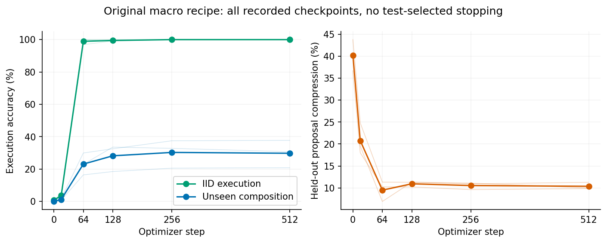

# 补充控制与训练时间轴

这些实验均在部分主结果已知后登记并运行，不冒充原预注册结果。原结果与失败保留。

## 缺少原语是否解释退化

原9个宏没有ends，新的测试家族有31/48隐含模式含ends，测试程序83.11%含ends，因此这是实质性混淆。固定人工覆盖干预把brown=inc,inc,inc替换为ends,inc,inc，其余调用链/输入/步数不变。三个seed真实累计训练输入和监督token逐项与原macro相同。

主提案设置：base 39.01%，原macro 9.06%，补齐覆盖 12.93%。提案包含ends比例恢复到47.53%；覆盖补齐相对原macro差+3.88个百分点，家族bootstrap区间-1.32 至 +10.76。不能把这点均值改善宣称为显著恢复，但它仍明显低于base。因此缺少一个原语不是充分解释；没有排除更广泛的训练分布狭窄。

## 候选停止长度控制

主实验允许长度2–3，3B模型训练后更偏好较短输出。追加每个家族固定8条长度2、8条长度3的语法配额，提示、T=1和选库器不变。

| 模型 | base | flat | macro |
|---|---:|---:|---:|
| qwen1.5b | 38.64% | 4.08% | 14.49% |
| qwen3b | 40.97% | 3.25% | 8.05% |
| smol1.7b | 36.43% | 7.39% | 9.72% |

完整seed差与区间见[length-results.json](analysis/length-results.json)。这是新解码条件，不能把数值直接当原采样分布的替换成绩。

## 原训练配方的完整时间轴

重新执行原宏训练三个seed，优化器和数据顺序保持，在固定步数插入只读评测，未根据测试分数选早停。

| 优化步 | IID执行 | 未见组合执行 | 新家族提案净压缩 |
|---|---:|---:|---:|
| 0 | 0.78% | 0.00% | 40.26% |
| 16 | 3.65% | 1.22% | 20.78% |
| 64 | 98.96% | 23.09% | 9.48% |
| 128 | 99.48% | 28.21% | 10.93% |
| 256 | 100.00% | 30.30% | 10.53% |
| 512 | 100.00% | 29.77% | 10.37% |

最终权重与原训练逐seed哈希一致检查：[{"seed": 33, "matches_original_final_weights": true}, {"seed": 22, "matches_original_final_weights": true}, {"seed": 11, "matches_original_final_weights": true}]。一致才可将曲线解释为同一确定性训练轨迹的检查点观察。

这里时间轴的采样随机数路径与主稳健性作业不同，所以最终提案净压缩10.37%与主表9.06%不是同一批提案；执行任务、最终模型权重相同。第16步提案效用已从40.26%降到20.78%，第64步约9.48%，下降不只出现在训练末期。

## 原配方梯度诊断

以下探针直接使用上述原配方检查点和执行数据，与主报告中闭环配方的诊断分开。每个检查点为三个seed各三个固定小批次；初始化检查点相同，九批不能当作九个独立模型。

| 步数 | 平均梯度余弦 | 负余弦批次 | 提案替代目标NLL |
|---|---:|---:|---:|
| 0 | +0.0944 | 0/9 | 2.6724 |
| 16 | -0.0470 | 8/9 | 1.1325 |
| 64 | -0.0080 | 5/9 | 1.4112 |
| 128 | -0.0382 | 6/9 | 1.4898 |
| 256 | -0.0427 | 7/9 | 1.4897 |
| 512 | -0.0438 | 8/9 | 1.5311 |

更新后多处出现局部梯度冲突，支持继续考察目标之间的干扰。但是第16步提案替代NLL比初始化更好，实际采样效用却已明显降低；因此该NLL不是提案效用的充分代理。梯度余弦既没有包含AdamW预条件的完整更新方向，也不构成长期退化的因果证明。闭环配方同样出现过负余弦而提案未持续下降，不能把“检测到负余弦”直接等同于RSI瓶颈。

## 退化提案者压力干预

主闭环中的提案者未必退化，因此另用第一轮确实退化的数字macro适配器作为外部提案者。学习器仍从同一个shared轮1检查点开始，提案支持、选库、执行器和128步训练保持；两个执行域均采用同一来源的原语序列提案。它检验人为引入退化提案源的总效应，**不是自然闭环自行陷入退化的证据**。

表中正数表示base/updated来源优于legacy来源；起点相同，因此是下一轮学习增益差。

| 域 | 比较 | 评测 | 差（百分点） | 三seed差 | 95% t区间 |
|---|---|---|---:|---|---|
| digits | base-legacy | short | +0.52 | +0.00 / +0.00 / +1.56 | -1.72 至 +2.76 |
| digits | base-legacy | family | +6.25 | +0.00 / +10.16 / +8.59 | -7.34 至 +19.84 |
| digits | base-legacy | pressure | +6.77 | +0.00 / +12.50 / +7.81 | -8.92 至 +22.46 |
| digits | updated-legacy | short | -0.52 | +0.00 / +0.00 / -1.56 | -2.76 至 +1.72 |
| digits | updated-legacy | family | +7.03 | +3.12 / +10.94 / +7.03 | -2.67 至 +16.73 |
| digits | updated-legacy | pressure | +6.77 | +3.12 / +10.94 / +6.25 | -3.00 至 +16.54 |
| strings | base-legacy | short | -3.12 | -3.12 / -6.25 / +0.00 | -10.89 至 +4.64 |
| strings | base-legacy | family | +1.82 | -8.59 / +9.38 / +4.69 | -21.33 至 +24.98 |
| strings | base-legacy | pressure | +0.52 | -6.25 / +7.81 / +0.00 | -16.98 至 +18.02 |
| strings | updated-legacy | short | -1.56 | -4.69 / +0.00 / +0.00 | -8.29 至 +5.16 |
| strings | updated-legacy | family | -2.86 | -13.28 / +9.38 / -4.69 | -31.28 至 +25.55 |
| strings | updated-legacy | pressure | +2.08 | +1.56 / +9.38 / -4.69 | -15.42 至 +19.59 |

每个来源实际产生的宏库、训练长度、语义覆盖及支持/保留程序压缩见[curriculum-rows.jsonl](analysis/curriculum-rows.jsonl)。提案源会改变课程长度和训练token数；这些比较是相同样本/步数下的总效应，不是等token的纯提案质量效应。抽象压缩P是候选代理指标，只有观察到后续学习变化G才与改进能力建立联系；二者不能互相代称。
