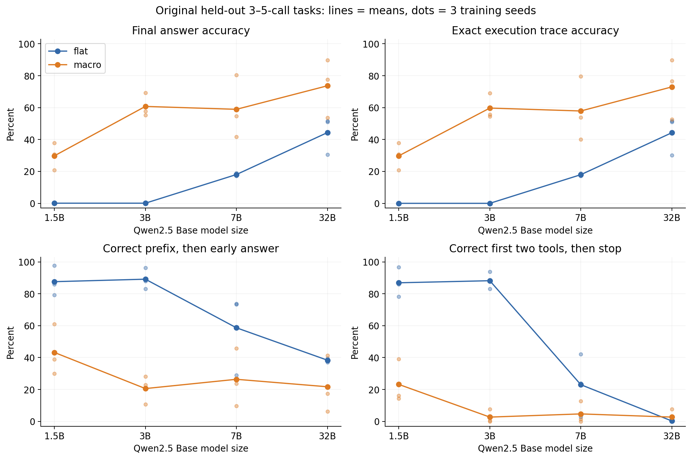
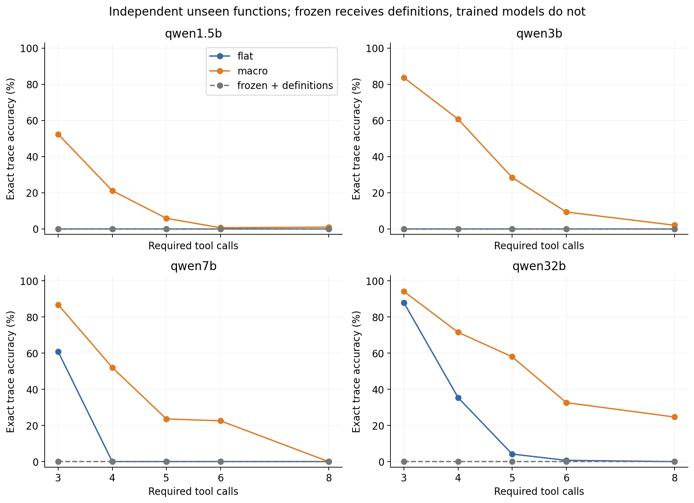
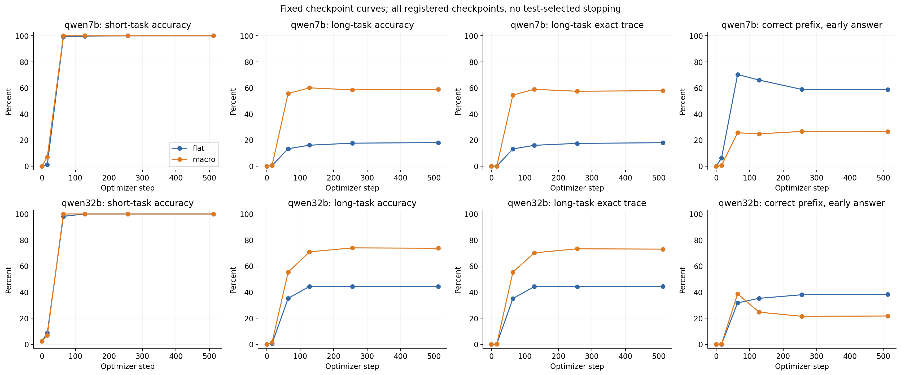

# Model scale and stopping after two segments: stage-one results

Generated at (UTC): 2026-09-24T17:15:07Z. Automatic aggregation is complete; scientific interpretation requires the review in CONCLUSIONS.md. Codex executed scripts directly, rather than through EvoScientist chat.

## Design and completed scope

Qwen2.5 Base 1.5/3/7/32B, with three training seeds each for flat and macro. Reuse existing 1.5/3B adapters; add six 512-step LoRA runs each for 7/32B. Use 4,096 training examples, effective batch size 32, and 16,384 example presentations. Inputs, primitive operations, and correct states are identical; only output segment headers differ between step and the corresponding tool name.

Two-call examples account for 90.38% of original training; none contain more than two calls. The original test contains 560 examples: 128 IID, 384 long compositions, and 48 stress examples. This report analyzes every output, without conditioning on macro success and flat failure. Training seeds are repeated training runs; repeated evaluation of one example does not create independent examples.

Registered checkpoints are 0/16/64/128/256/512, with all weights saved. Development evaluation runs during training; fixed checkpoints are tested after training, without test-based checkpoint selection. Model revisions and SHA hashes are in models/*/download-manifest.json.

The independent confirmation set contains 480 examples: 24 programs at each call length 3/4/5/6/8 and four inputs per program, totaling 120 programs. Exact functions are disjoint from old train/dev/test functions. New tests allow 512 generated tokens; old examples allow 256. Frozen baselines on new examples receive full tool definitions, since the base cannot know artificial color mappings without them. Interpret conditions with and without definitions separately.

## Original test: unseen 3–5 calls, means over three seeds

| Model | Label | Answer accuracy | Complete trajectory accuracy | Early answer after correct prefix | Stops after first two correct tools | Exactly two segments |
|---|---|---:|---:|---:|---:|---:|
| qwen1.5b | flat | 0.09% | 0.00% | 87.59% | 86.89% | 100.00% |
| qwen1.5b | macro | 29.77% | 29.77% | 43.23% | 23.18% | 26.30% |
| qwen3b | flat | 0.09% | 0.00% | 89.15% | 88.19% | 100.00% |
| qwen3b | macro | 60.76% | 59.72% | 20.57% | 2.69% | 4.43% |
| qwen7b | flat | 18.06% | 17.97% | 58.68% | 23.00% | 23.61% |
| qwen7b | macro | 58.94% | 57.90% | 26.39% | 4.69% | 4.95% |
| qwen32b | flat | 44.36% | 44.27% | 38.37% | 0.26% | 0.26% |
| qwen32b | macro | 73.70% | 73.00% | 21.70% | 2.69% | 2.69% |

“Stops after first two correct tools” requires a correct operation/numeric prefix and a voluntary answer matching that intermediate state. This is a directly verifiable subset of early stopping; other operation errors or omissions are not forced into it. Two segments describe output behavior, not process correctness. Original code saved non-EOS token counts without final token IDs. Counts below the limit minus one imply EOS before the cap under the generation configuration; exactly limit-minus-one is ambiguous, and reaching the cap indicates exhaustion. These are inferences, not directly logged stop reasons. EOS does not imply task completion, and intermediate answers must be assessed against the full trajectory. Correct answers with incorrect trajectories fail the complete-trajectory metric.

## Local operation and formatting errors

The following metrics overlap and cannot be summed into mutually exclusive cause shares. Wrong operation means an emitted operation differs from the required order or is extra; simply omitting a suffix does not count here. Numeric errors are checked against the preceding reported state, avoiding repeated attribution of propagated upstream errors as fresh arithmetic mistakes. These are behavioral observations, not causal mechanism evidence.

| Model | Label | Wrong operation | Wrong arithmetic | Extra formatting lines | Missing or multiple answers |
|---|---|---:|---:|---:|---:|
| qwen1.5b | flat | 12.24% | 0.17% | 0.00% | 0.00% |
| qwen1.5b | macro | 27.00% | 0.00% | 0.00% | 0.00% |
| qwen3b | flat | 10.85% | 0.00% | 0.35% | 0.00% |
| qwen3b | macro | 19.62% | 0.09% | 0.00% | 0.00% |
| qwen7b | flat | 23.26% | 0.17% | 0.00% | 0.00% |
| qwen7b | macro | 15.71% | 0.00% | 0.00% | 0.00% |
| qwen32b | flat | 17.36% | 0.00% | 0.00% | 0.00% |
| qwen32b | macro | 5.30% | 0.00% | 0.00% | 0.00% |

## Paired differences and intervals

The table reports macro−flat answer accuracy in percentage points. Seed intervals are t intervals over three training seeds. Program intervals bootstrap complete call-chain clusters conditional on those seeds. The intervals describe different uncertainty.

| Model | Mean difference | Three seed differences | Seed 95% t interval | Program-clustered 95% interval |
|---|---:|---|---|---|
| qwen1.5b | +29.69 | +30.47 / +37.76 / +20.83 | +8.60 to +50.78 | +22.48 to +37.15 |
| qwen3b | +60.68 | +57.55 / +69.27 / +55.21 | +41.96 to +79.39 | +53.39 to +67.88 |
| qwen7b | +40.89 | +35.68 / +62.50 / +24.48 | -7.65 to +89.42 | +34.64 to +47.14 |
| qwen32b | +29.34 | +23.18 / +26.04 / +38.80 | +8.68 to +50.00 | +22.14 to +36.37 |

## Fresh confirmation and longer call sequences

Frozen means the untuned base with tool definitions. Other conditions are trained models without definitions. These prompt differences prevent direct interpretation as training gains or losses.

| Model | Condition | Length group | Answer accuracy | Complete trajectory accuracy | Stops after first two correct tools |
|---|---|---|---:|---:|---:|
| qwen1.5b | flat | length3 | 0.00% | 0.00% | 87.50% |
| qwen1.5b | flat | length4 | 1.04% | 0.00% | 80.90% |
| qwen1.5b | flat | length5 | 1.04% | 0.00% | 80.90% |
| qwen1.5b | flat | length6 | 1.04% | 0.00% | 81.94% |
| qwen1.5b | flat | length8 | 0.35% | 0.00% | 73.96% |
| qwen1.5b | macro | length3 | 52.43% | 52.43% | 39.24% |
| qwen1.5b | macro | length4 | 21.18% | 21.18% | 21.18% |
| qwen1.5b | macro | length5 | 5.90% | 5.90% | 9.38% |
| qwen1.5b | macro | length6 | 0.69% | 0.69% | 11.46% |
| qwen1.5b | macro | length8 | 1.04% | 1.04% | 6.25% |
| qwen1.5b | frozen | length3 | 0.00% | 0.00% | 0.00% |
| qwen1.5b | frozen | length4 | 0.00% | 0.00% | 0.00% |
| qwen1.5b | frozen | length5 | 0.00% | 0.00% | 0.00% |
| qwen1.5b | frozen | length6 | 0.00% | 0.00% | 0.00% |
| qwen1.5b | frozen | length8 | 0.00% | 0.00% | 0.00% |
| qwen3b | flat | length3 | 0.00% | 0.00% | 92.71% |
| qwen3b | flat | length4 | 0.69% | 0.00% | 84.03% |
| qwen3b | flat | length5 | 1.04% | 0.00% | 84.03% |
| qwen3b | flat | length6 | 0.35% | 0.00% | 75.69% |
| qwen3b | flat | length8 | 0.00% | 0.00% | 64.93% |
| qwen3b | macro | length3 | 83.68% | 83.68% | 7.99% |
| qwen3b | macro | length4 | 60.76% | 60.76% | 2.78% |
| qwen3b | macro | length5 | 28.82% | 28.47% | 3.47% |
| qwen3b | macro | length6 | 10.07% | 9.38% | 1.39% |
| qwen3b | macro | length8 | 2.43% | 2.08% | 2.78% |
| qwen3b | frozen | length3 | 0.00% | 0.00% | 0.00% |
| qwen3b | frozen | length4 | 0.00% | 0.00% | 0.00% |
| qwen3b | frozen | length5 | 0.00% | 0.00% | 0.00% |
| qwen3b | frozen | length6 | 0.00% | 0.00% | 0.00% |
| qwen3b | frozen | length8 | 0.00% | 0.00% | 0.00% |
| qwen7b | flat | length3 | 60.76% | 60.76% | 20.83% |
| qwen7b | flat | length4 | 0.35% | 0.00% | 10.76% |
| qwen7b | flat | length5 | 0.00% | 0.00% | 22.22% |
| qwen7b | flat | length6 | 0.69% | 0.00% | 23.61% |
| qwen7b | flat | length8 | 0.00% | 0.00% | 27.08% |
| qwen7b | macro | length3 | 86.81% | 86.81% | 4.86% |
| qwen7b | macro | length4 | 52.08% | 52.08% | 1.39% |
| qwen7b | macro | length5 | 23.61% | 23.61% | 2.43% |
| qwen7b | macro | length6 | 22.57% | 22.57% | 0.00% |
| qwen7b | macro | length8 | 0.00% | 0.00% | 1.39% |
| qwen7b | frozen | length3 | 0.00% | 0.00% | 0.00% |
| qwen7b | frozen | length4 | 0.00% | 0.00% | 0.00% |
| qwen7b | frozen | length5 | 0.00% | 0.00% | 0.00% |
| qwen7b | frozen | length6 | 0.00% | 0.00% | 0.00% |
| qwen7b | frozen | length8 | 0.00% | 0.00% | 0.00% |
| qwen32b | flat | length3 | 87.85% | 87.85% | 1.39% |
| qwen32b | flat | length4 | 36.81% | 35.42% | 1.04% |
| qwen32b | flat | length5 | 4.51% | 4.17% | 0.00% |
| qwen32b | flat | length6 | 1.04% | 0.69% | 0.35% |
| qwen32b | flat | length8 | 0.35% | 0.00% | 0.00% |
| qwen32b | macro | length3 | 94.10% | 94.10% | 5.90% |
| qwen32b | macro | length4 | 71.53% | 71.53% | 0.69% |
| qwen32b | macro | length5 | 57.99% | 57.99% | 2.78% |
| qwen32b | macro | length6 | 32.64% | 32.64% | 0.35% |
| qwen32b | macro | length8 | 24.65% | 24.65% | 1.74% |
| qwen32b | frozen | length3 | 0.00% | 0.00% | 0.00% |
| qwen32b | frozen | length4 | 0.00% | 0.00% | 0.00% |
| qwen32b | frozen | length5 | 0.00% | 0.00% | 0.00% |
| qwen32b | frozen | length6 | 0.00% | 0.00% | 0.00% |
| qwen32b | frozen | length8 | 0.00% | 0.00% | 0.00% |

## Measured resources and implementation checks

| Model | Microbatch | Accumulation steps | Two-step calibration peak GiB | Calibration seconds/optimization step |
|---|---:|---:|---:|---:|
| qwen7b | 16 | 2 | 20.47 | 1.57 |
| qwen32b | 16 | 2 | 69.74 | 5.44 |

Approximately 59.61 GPU-hours; see analysis/cost.json for the accounting definition. This includes supplementary training/evaluation processes but excludes downloads, prelaunch queues, incompletely timed failed starts, and separate cross-GPU smoke checks. Early-checkpoint evaluation processes may include waiting for weights and do not measure pure GPU kernel activity. Data and caches remain in the project directory.

Splitting microbatch 16 into four failed the prespecified 3% relative BF16 gradient tolerance; failed records remain. A 1.5B check retaining microbatch 16 and enabling only gradient checkpointing matched loss/gradients. Actual microbatches are listed above; fallbacks require acknowledging floating-point implementation differences. The primary study uses no quantization.

## Interpretation limits and unfinished research branches

This is within-family scale association, not fully randomized causal identification of parameter count. Pretraining, architecture, and LoRA proportions are not completely controlled. Larger models do not automatically have more stable priors.

Symmetric 1e-4 learning-rate supplements for 3B/32B and three-seed flat/macro 32B-Instruct training, fixed final evaluation, and the frozen Instruct baseline are complete; see [SUPPLEMENT.md](SUPPLEMENT.md). This is still not real-agent interaction validation. Frozen models do not establish reliable initial long-execution capability under this protocol, so prior preservation/destruction remains unidentified. Same-information pre/post-training comparisons are in analysis/matched-context.json.

[CONCLUSIONS.md](CONCLUSIONS.md) reports major findings, LoRA proportions, and protocol deviations. analysis/outcome-diagnostics.json adds complete classifications of equivalent trajectories and chance-correct answers. Fixed curves do not select checkpoints using test scores. Development mastery thresholds were not numerically preregistered; later thresholds are exploratory only.

## Figures

Matching SVG/PDF files are provided. All three figure groups were visually checked. Lines connect fixed-checkpoint means and do not establish values at unmeasured intermediate steps.

## Reproduction materials

- [Final example-level audit](analysis/final-case-audit.jsonl), [original-test statistics](analysis/results.json), and [independent-confirmation statistics](analysis/extended-results.json).
- [Paired intervals](analysis/paired-inference.json), [data registration](analysis/extended-data-registration.json), and [registration and amendments](WORK_STATUS.md).
- Raw outputs in each model runs/ and extended/ directory; final and intermediate LoRA adapters retained in full.
